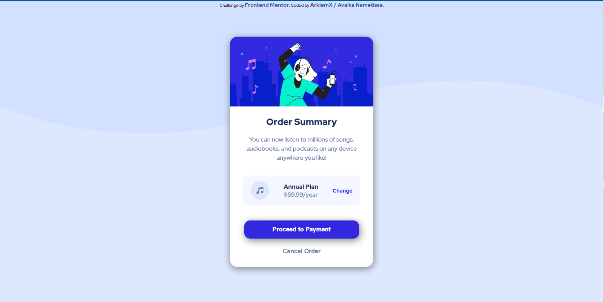
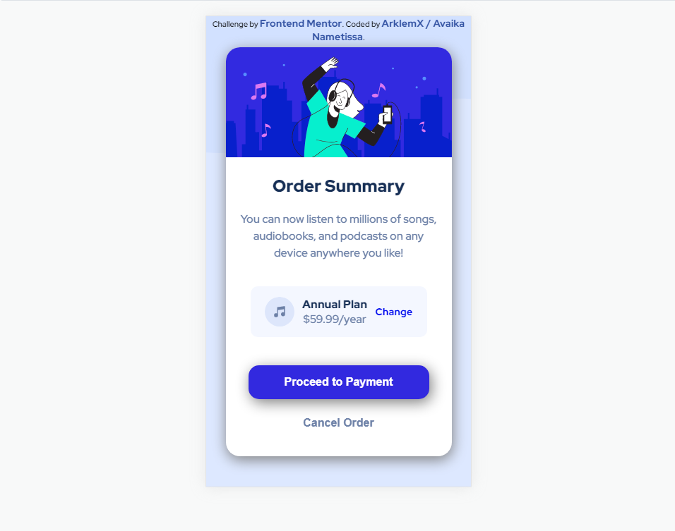

# Frontend Mentor - Order summary card solution

This is a solution to the [Order summary card challenge on Frontend Mentor](https://www.frontendmentor.io/challenges/order-summary-component-QlPmajDUj). Frontend Mentor challenges help you improve your coding skills by building realistic projects. 

## Table of contents

- [Overview](#overview)
  - [Screenshot](#screenshot)
  - [Links](#links)
- [My process](#my-process)
  - [Built with](#built-with)
  - [Continued development](#continued-development)
- [Author](#author)

## Overview
### Screenshot

### Links

- Solution URL: [My Solution, Right Here](https://github.com/ArklemX/order-summary-component-main/)
- Live Site URL: [The Solution, in LIVE](https://arklemx.github.io/order-summary-component-main/solution.html)

## My process

  To reach the end of this Challenge, i made it like this :
- Structure With HTML: I begun by making the structure of the product. I think that it is much simple. 
- Style With CSS : Next , i continuously adjusted the CSS to reach the goal i'd.
### Built with

- Semantic HTML5 markup
- CSS custom properties

### Continued development

Right now , i know i still have to learn about

## Author

- Frontend Mentor - [@AklemX](https://www.frontendmentor.io/profile/ArklemX)

Thanks ! X)